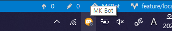

# MK Bot
Discord Bot developed by Mulgyeol Labs  
API provided by: https://discordapp.com/developers/applications

>  This project is managed by @myftbot

## Features
* [x] TTS voices
* [x] Message Deleter
* [x] Local Hosting
* [x] User Access Control



## Development Guide

~"Category:Bot" ~"Category:MSU" ~"Category:Console"

1. Enter the following commands in terminal.

```bat
.\scripts\venv.bat
.\scripts\prepare.bat
```

2. Edit `config.json`, `mgcert.json` at `src\data` and `src\console\bin\Debug\data` directory.

* config.json
```json
{
    "discordToken":"Your Bot TOKEN",
    "kakaoToken":"Your KakaoTalk REST API Token",
    "__DEBUG_MODE__": true
}
```
* mgcert.json
```json
{
    "adminUsers":["admin_username#0000"],
    "trustedUsers":["trusted_username#0000"]
}
```
----

> :warning: **WARNING**: `.gitlab-ci.yml`, `Procfile`, `runtime.txt`, `requirements.txt` are required when running the program on the server, so errors may occur when changing.

For more infomation, See [Project Wiki](https://gitlab.com/mgylabs/discord-bot/-/wikis/home).

## How to Push into master
>  You should create a personal fork or create another branches there when you push changes, and then create Merge Requests to master branch.

1.  Create a new branch.
2.  Push into the branch.
3.  Create a new Merge Request.
4.  When you add a ~AutoMerge label to the Merge Request, @myftbot will automatically merge it when requirements are met.

[Learn more](https://gitlab.com/mgylabs/developer/taehyeokkang/MGYLBot/-/wikis/Auto-Merge)